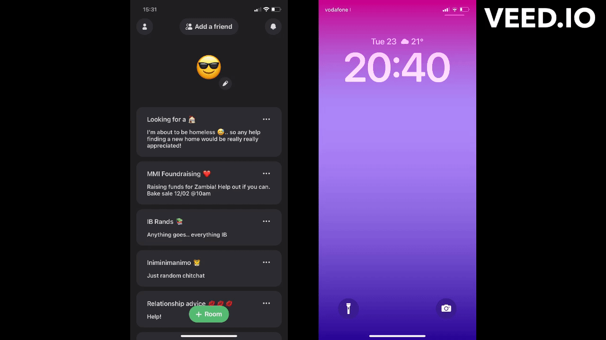
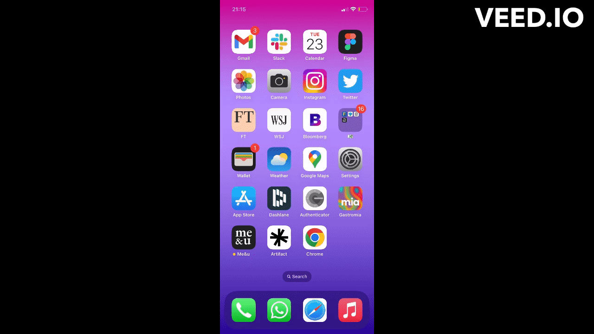
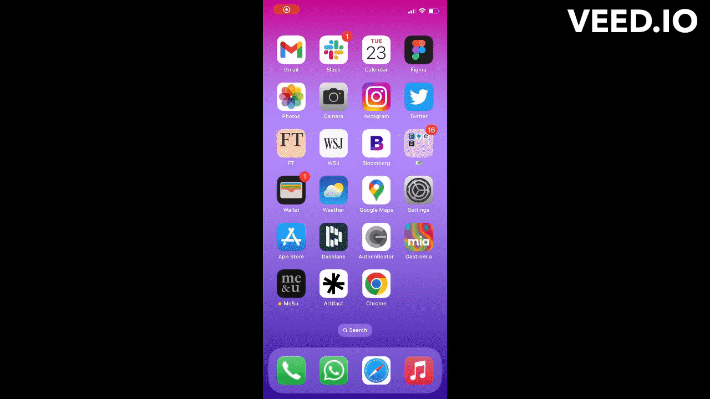
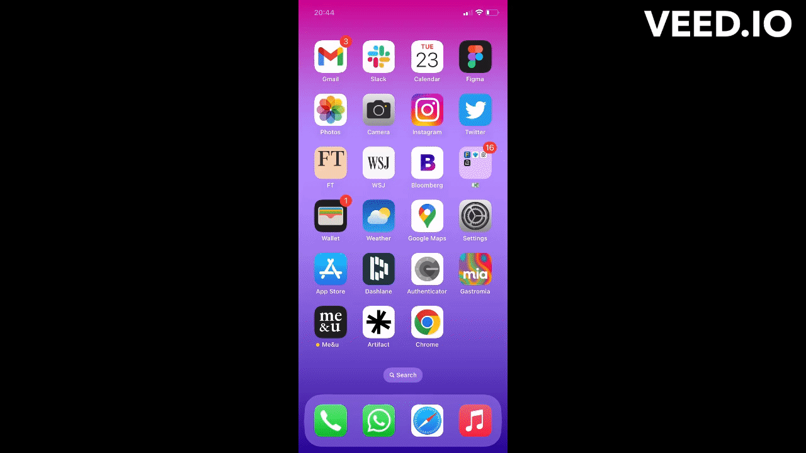

# Me&u
Me&u was developed to enable small group of friends to engage in conversations on everyday topics. The app was heavily inspired by Locket, and borrows some of its functionality from Whatsapp groups. 

The project is divided into two repositories:
- [me-u](https://github.com/fredgrd/me-u/) – User-facing iOS app
- [api-meu](https://github.com/fredgrd/api-meu) – Backend powering the real-time comms between clients

## Introduction
Add your friends and create rooms to chat with them about what is going on in your life. Built with **Swift** and powered by a **Node.js** backend, me&u uses a native implementation of WebSockets to enable you to chat with your friends in a whatsapp meets boards type of environment. 

## Technologies

### Backend
- Node.js
- Express
- WebSocket (ws)
- MongoDB Atlas
- Mongoose
- AWS (S3 + Elastic Beanstalk)
- Firebase Cloud Messaging 
- Twilio

### Frontend 
- Swift (UIkit)
- WebSocket (URLSessionWebSocketTask)
- Firebase Cloud Messaging (Notifications)

## Flows

### Auth Flow

#### Signup

#### Login

#### Friend Request

#### Message + Notification

#### Real-time Chat

