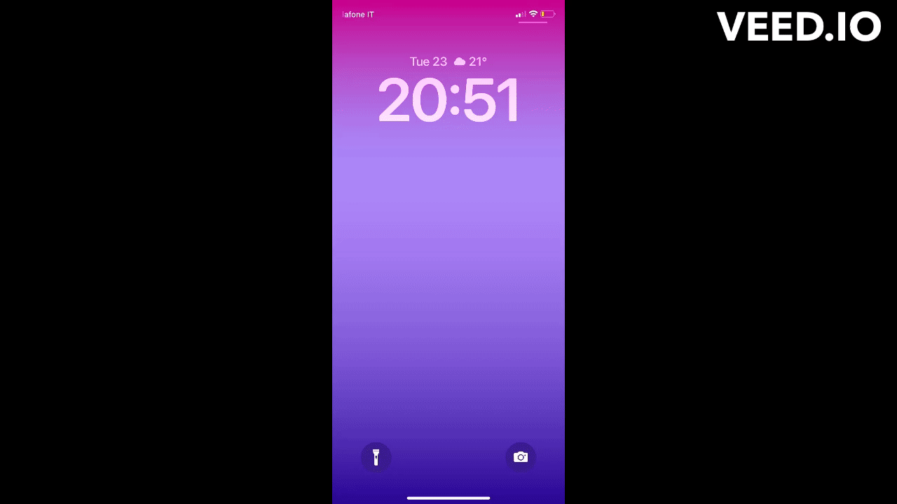

# Me&u
Me&u was developed to gain more experience in using the Swift language, especially in the context of live communications between clients. 

## Introduction
Add your friends and create rooms to chat with them about what is going on in your life. Built with Swift and powered by a NodeJS backend, me&u uses a native implementation of WebSockets to enable you to chat with your friends in a whatsapp meets boards type of environment. 

## Flows

### Auth Flow

#### Signup

#### Login

#### Friend Request

#### Message + Notification

## Technologies
- Swift (UIKit)
- WebSockets (ws on BE and native implementation on the FE)
- NodeJS + Express + Ws (Backend)
- MongoDB (Mongoose)
- Twilio Verify (Auth)
- Firebase Cloud Messaging (Chat notifications)
- AWS S3 (Media storage)
- AWS Elastic Bean (Backend hosting)
